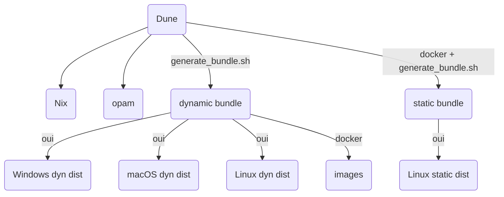

This documention is intended for GeneWeb developers only. If you are looking for
installation instructions, please refer to `INSTALL.md` file.

# Setup development environment

## with opam
To install all the dependencies to build all GeneWeb, run
```console
opam install . --deps-only --with-test
```

If you don't want to compile the RPC optional feature, you can only install
dependencies for GeneWeb as follows,
```console
opam install ./geneweb.opam --deps-only --with-test
```

## with Nix

You need the nix package manager and the experimental flake feature enabled.
Simply run at the root of the project
```console
nix develop
```

# Release workflow



# Produce bundle

In this section, we assume that you have a working development environment
to build GeneWeb itself. To build bundles on Linux, you need
- `makeself`
- `patchelf`
- `oui`

## Dynamically linked distribution
Run the following command
```console
make bundle
```
It produces a self-contained installer at the root of the project for
your current operating system and architectures.

## Statically linked distribution

You need the following static libraries:
- musl library
- gmp
- PCRE 2

```console
make bundle-static
```
